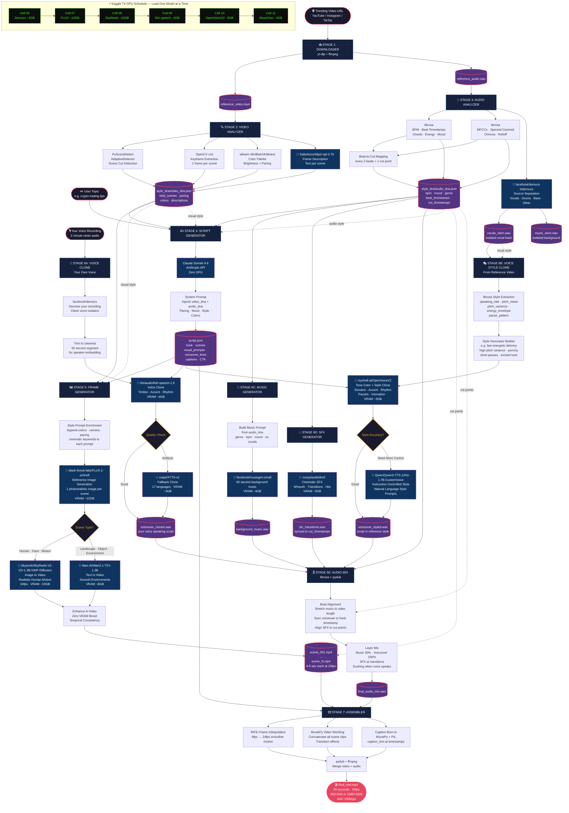

# Video-workflow

## FinanceReel AI — Pipeline Architecture

```mermaid
flowchart TD
    %% ─── INPUTS ───────────────────────────────────────────
    A([🌐 Trending Video URL\nYouTube / Instagram / TikTok])
    B([🎙️ Your Voice Recording\n2 minute clean audio])
    C([✏️ User Topic\ne.g. crypto trading tips])
    %% ─── STAGE 1: DOWNLOAD ────────────────────────────────
    A --> D[📥 STAGE 1: DOWNLOADER\nyt-dlp + ffmpeg]
    D --> D1[(reference_video.mp4)]
    D --> D2[(reference_audio.wav)]
    %% ─── STAGE 2: VIDEO ANALYZER ──────────────────────────
    D1 --> E[🔍 STAGE 2: VIDEO ANALYZER]
    E --> E1[PySceneDetect\nAdaptiveDetector\nScene Cut Detection]
    E --> E2[OpenCV cv2\nKeyframe Extraction\n1 frame per scene]
    E --> E3[sklearn MiniBatchKMeans\nColor Palette\nBrightness + Pacing]
    E --> E4[🤗 Salesforce/blip2-opt-2.7b\nFrame Description\nText per scene]
    E1 & E2 & E3 & E4 --> E5[(style_dna/video_dna.json\ntotal_scenes · pacing\ncolors · descriptions)]
    %% ─── STAGE 3: AUDIO ANALYZER ──────────────────────────
    D2 --> F[🎵 STAGE 3: AUDIO ANALYZER]
    F --> F1[librosa\nBPM · Beat Timestamps\nOnsets · Energy · Mood]
    F --> F2[librosa\nMFCCs · Spectral Centroid\nChroma · Rolloff]
    F --> F3[🤗 facebook/demucs htdemucs\nSource Separation\nVocals · Drums · Bass · Other]
    F1 --> F4[Beat-to-Cut Mapping\nevery 2 beats = 1 cut point]
    F2 --> F4
    F3 --> F5[(vocals_stem.wav\nisolated vocal track)]
    F3 --> F6[(music_stem.wav\nisolated background)]
    F1 & F2 & F4 --> F7[(style_dna/audio_dna.json\nbpm · mood · genre\nbeat_timestamps · cut_timestamps)]
    %% ─── STAGE 4: SCRIPT GENERATOR ────────────────────────
    E5 --> G[✍️ STAGE 4: SCRIPT GENERATOR]
    F7 --> G
    C --> G
    G --> G1[Claude Sonnet 4-6\nAnthropic API\nZero GPU]
    G1 --> G2[System Prompt\nInjects video_dna + audio_dna\nPacing · Mood · Style · Colors]
    G2 --> G3[(script.json\nhook · scenes\nvisual_prompts · voiceover_lines\ncaptions · CTA)]
    %% ─── STAGE 5: FRAME GENERATOR ─────────────────────────
    G3 --> H[🖼️ STAGE 5: FRAME GENERATOR]
    E5 --> H
    H --> H1[Style Prompt Enrichment\nAppend colors · camera · pacing\ncinematic keywords to each prompt]
    H1 --> H2[🤗 black-forest-labs/FLUX.1-schnell\nReference Image Generation\n1 photorealistic image per scene\nVRAM ~12GB]
    H2 --> H3{Scene Type?}
    H3 -->|Human · Face · Motion| H4[🤗 Skywork/SkyReels-V2-I2V-1.3B-540P-Diffusers\nImage to Video\nRealistic Human Motion\n24fps · VRAM ~10GB]
    H3 -->|Landscape · Object · Environment| H5[🤗 Wan-AI/Wan2.1-T2V-1.3B\nText to Video\nSmooth Environments\nVRAM ~8GB]
    H4 --> H6[Enhance-A-Video\nZero VRAM Boost\nTemporal Consistency]
    H5 --> H6
    H6 --> H7[(scene_001.mp4\n...\nscene_N.mp4\n4-5 sec each at 24fps)]
    %% ─── STAGE 6A: VOICE CLONE ─────────────────────────────
    B --> I[🎤 STAGE 6A: VOICE CLONE\nYour Own Voice]
    I --> I1[facebook/demucs\nDenoise your recording\nClean voice isolation]
    I1 --> I2[Trim to cleanest\n30 second segment\nfor speaker embedding]
    I2 --> I3[🤗 fishaudio/fish-speech-1.5\nVoice Clone\nTimbre · Accent · Rhythm\nVRAM ~4GB]
    I3 --> I4{Quality Check}
    I4 -->|Good| I5[(voiceover_cloned.wav\nyour voice speaking script)]
    I4 -->|Artifacts| I6[🤗 coqui/XTTS-v2\nFallback Clone\n17 languages · VRAM ~3GB]
    I6 --> I5
    G3 --> I3
    %% ─── STAGE 6B: VOICE STYLE CLONE ───────────────────────
    F5 --> J[🎭 STAGE 6B: VOICE STYLE CLONE\nFrom Reference Video]
    J --> J1[librosa Style Extraction\nspeaking_rate · pitch_mean\npitch_variance · energy_envelope\npause_pattern]
    J1 --> J2[Style Descriptor Builder\ne.g. fast energetic delivery\nhigh pitch variance · punchy\nshort pauses · excited tone]
    J2 --> J3[🤗 myshell-ai/OpenVoiceV2\nTone Color + Style Clone\nEmotion · Accent · Rhythm\nPauses · Intonation · VRAM ~3GB]
    J3 --> J4{Style Accuracy?}
    J4 -->|Good| J5[(voiceover_styled.wav\nscript in reference style)]
    J4 -->|Need More Control| J6[🤗 Qwen/Qwen3-TTS-12Hz-1.7B-CustomVoice\nInstruction-Controlled Style\nNatural Language Style Prompts]
    J6 --> J5
    G3 --> J3
    %% ─── STAGE 6C: BACKGROUND MUSIC ────────────────────────
    F7 --> K[🎼 STAGE 6C: MUSIC GENERATOR]
    K --> K1[Build Music Prompt\nfrom audio_dna\ngenre · bpm · mood · no vocals]
    K1 --> K2[🤗 facebook/musicgen-small\n60 second background music\nVRAM ~4GB]
    K2 --> K3[(background_music.wav)]
    %% ─── STAGE 6D: SOUND EFFECTS ───────────────────────────
    F7 --> L[💥 STAGE 6D: SFX GENERATOR]
    L --> L1[🤗 cvssp/audioldm2\nCinematic SFX\nWhoosh · Transitions · Hits\nVRAM ~6GB]
    L1 --> L2[(sfx_transitions.wav\nsynced to cut_timestamps)]
    %% ─── STAGE 6E: AUDIO MIX ───────────────────────────────
    I5 --> M[🎚️ STAGE 6E: AUDIO MIX\nlibrosa + pydub]
    J5 --> M
    K3 --> M
    L2 --> M
    F7 --> M
    M --> M1[Beat Alignment\nStretch music to video length\nSync voiceover to hook timestamp\nAlign SFX to cut points]
    M1 --> M2[Layer Mix\nMusic 30% · Voiceover 100%\nSFX at transitions\nDucking when voice speaks]
    M2 --> M3[(final_audio_mix.wav)]
    %% ─── STAGE 7: ASSEMBLER ─────────────────────────────────
    H7 --> N[🎞️ STAGE 7: ASSEMBLER]
    M3 --> N
    G3 --> N
    N --> N1[RIFE Frame Interpolation\n8fps → 24fps smoother motion]
    N --> N2[MoviePy Video Stitching\nConcatenate all scene clips\nTransition effects]
    N --> N3[Caption Burn-in\nMoviePy + PIL\ncaption_text at timestamps]
    N1 & N2 & N3 --> N4[pydub + ffmpeg\nMerge video + audio]
    N4 --> Z([🎬 final_reel.mp4\n60 seconds · 24fps\n960×540 or 1080×1920\nAAC 192kbps])
    %% ─── STYLE DNA SHARED LAYER ─────────────────────────────
    E5 -.->|visual style| H
    E5 -.->|visual style| G
    F7 -.->|audio style| G
    F7 -.->|cut points| H7
    F7 -.->|cut points| M1
    F5 -.->|vocal style| J
    %% ─── KAGGLE T4 GPU NOTES ────────────────────────────────
    subgraph GPU_SCHEDULE ["⚡ Kaggle T4 GPU Schedule — Load One Model at a Time"]
        direction LR
        S1[Cell 05\nDemucs ~3GB]
        S2[Cell 07\nFLUX ~12GB]
        S3[Cell 08\nSkyReels ~10GB]
        S4[Cell 09\nfish-speech ~4GB]
        S5[Cell 10\nOpenVoiceV2 ~3GB]
        S6[Cell 11\nMusicGen ~4GB]
        S1 --> S2 --> S3 --> S4 --> S5 --> S6
    end
    %% ─── STYLES ─────────────────────────────────────────────
    classDef input fill:#1a1a2e,stroke:#e94560,color:#fff,stroke-width:2px
    classDef stage fill:#16213e,stroke:#0f3460,color:#fff,stroke-width:2px
    classDef model fill:#0f3460,stroke:#533483,color:#fff,stroke-width:2px
    classDef data fill:#533483,stroke:#e94560,color:#fff,stroke-width:2px
    classDef output fill:#e94560,stroke:#fff,color:#fff,stroke-width:3px
    classDef decision fill:#1a1a2e,stroke:#f5a623,color:#f5a623,stroke-width:2px
    classDef gpu fill:#0d0d0d,stroke:#39ff14,color:#39ff14,stroke-width:1px
    class A,B,C input
    class D,E,F,G,H,I,J,K,L,M,N stage
    class E4,F3,G1,H2,H4,H5,I3,I6,J3,J6,K2,L1 model
    class D1,D2,E5,F5,F6,F7,G3,H7,I5,J5,K3,L2,M3 data
    class Z output
    class H3,I4,J4 decision
    class S1,S2,S3,S4,S5,S6 gpu
```